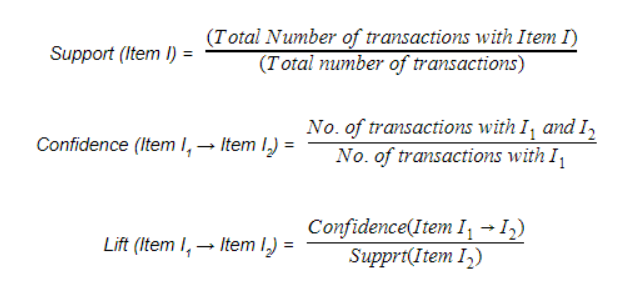

# Market-Basket-Analysis of
1. Grocery Dataset
2. Online Retail

## Business Value

Market Basket Analysis is the analysis of past buying behaviourof customers to find out which are the products that are bought together by the customers. That means to find out the association between various products. If the retail's management can find this association, while placing the products in the shop, these associated products can be put together. Or, when seeing that a customer is buying a product, the salesman can offer the associated product to the customer.  

We find this association by Association Rule learning which is a machine-learning rule based approach that generates relationship between variables in a dataset. It has major application in retail industry including e-commerce. 

## Problem Statement

To determine the association between various products in the basket by analysing the customer purchase pattern of multiple items.

## Data

__Grocery data__

Each row of data represents a transaction and the attributes the product purchased. For value 0 the attribute item has not been purchased, for value the attribute item has been purchased in that particular transaction

__Online Retail__

Each row of data represents a transaction for a particular item and the attributes correspond to the following:

__InvoiceNo__ : Unique identifier for transaction 

__StockCode__ : Unique identifier for the stock item being purchased

__Description__ : Description of item

__Quantity__ : Number of units purchased

__InvoiceDate__ : Date of purchase

__UnitPrice__ : Cost of one unit of the item

__CustomerID__ : Unique Identifier for customer 

__Country__ : Country of transaction

## Approach

+ Importing Necessary Dependencies

+ Loading Data

+ Data Exploration and Visualization
	
+ Data Processing
    
	- Data Cleaning
	- Transforming data to one transaction per row
	- One Hot Encoding of purchases made

+ Generating Association Rules

+ Refining the rules 

## Evaluation

In order to establish association rules between items we will be using the apriori algorithm which uses a bottomm-up approach where frequent items (items bought together) are extended one item at a time and groups of candidates are tested against the availbale dataset. The process continues until no further extensions are found. It uses the concept of Support, Confidence and Lift to establish the rules. 

Rules which have a higher support and confidence than the predefined support and confidence are taken into account.

Support, confidence and Lift is given by:

## Data Exploration and Visualization

### Grocery Dataset__

__Top Sold Items__

__Association Rules__

### Online Retail Dataset

__Processed Data__

__Association Rules__

__Selected Rules__

## __Conclusion__

__Grocery Dataset__

The rules states that people who bought _other vegetables_ are likely to purchase _root vegetables_ and the Confidence of the rule is 46% which means 46% of the time people bought _other vegetables_ they also bought _root vegetables_ and the Lift for the given rule is 2.24 which means the probability of finding the _root vegetables_ in the transactions having _other vegetables_ is greater than the normal probability of finding the it had the two items been not associated. A lift value of 1 indicates absence of association between the two items.

__Online Dataset__

Understanding the rules for this dataset we see _SET/6 RED SPOTTY PAPER PLATES_ has a confidence of 80% and lift of 6.03 with itemset _SET/20 RED RETROSPOT PAPER NAPKINS_ which means 80% of the times when the latter item was bought _SET/6 RED SPOTTY PAPER PLATES_ was also bought. 
